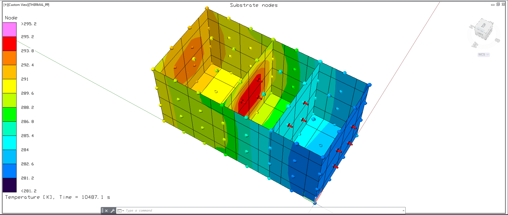
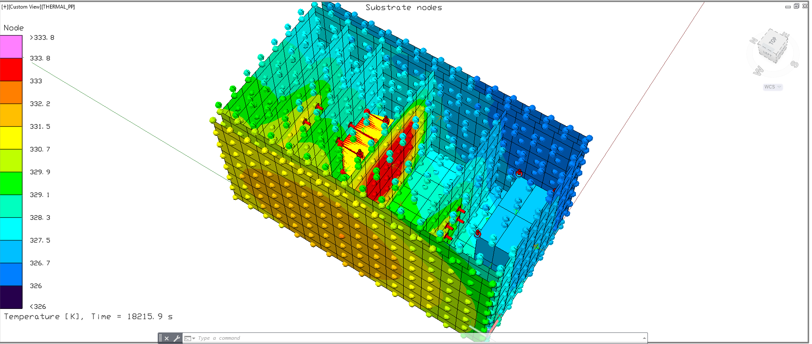

# Spartan Sat — Thermal Engineering

**Thermal analysis and control design for the Spartan Sat 2U CubeSat (LEO → lunar flyby), SJSU CubeSat program.**

- **Mission:** 2U CubeSat, ISS deployment to low Earth orbit (~400 km), with a follow-on lunar flyby phase.
- **My role:** sole thermal engineer — environment definition, CAD integration, Thermal Desktop / RadCAD model, materials trade study, post-processing, Rev 1 → Rev 5 design iteration, preliminary TVAC testing.
- **Technology stack:** C&R Thermal Desktop + RadCAD (primary), ANSYS Workbench Mechanical (verification), SolidWorks (CAD), Python (post-processing).
- **Headline finding:** The Rev 5 bare-anodize 2U design reaches **~74 °C panel average in the hot case** — above the battery's 40 °C operational ceiling. A low-α coating patch (NZOT white paint or silvered FEP film) on the +Z panel brings the design back inside the battery operational band with positive margin.

## Contents

| Folder | What's in it |
|--------|--------------|
| [`docs/`](docs/) | Seven short technical documents — mission, requirements, methodology, materials, results, iteration history, TVAC testing |
| [`figures/`](figures/) | Plots and simulation renders used in this README and the docs |
| [`data/`](data/) | Orbital heat-flux boundary conditions, component thermal budget, materials properties, raw simulation output |
| [`analysis/`](analysis/) | Python scripts that regenerate every plot from the data in `data/` |

## Mission and Environment

Spartan Sat is designed for a LEO orbit at ~400 km (ISS-like). The thermal environment is bounded by:

| Source | Value |
|--------|-------|
| Solar flux | ~1361 W/m² |
| Earth albedo | 0.14–0.19 → ~185–270 W/m² |
| Earth IR | ~218–228 W/m² |

The ~95-minute orbit is split into ~60 min sunlit arc and ~35 min eclipse. Two bounding design cases are carried through the analysis: a **hot case** (β = 60°, solar = 1419 W/m², albedo = 0.55) and a **cold case** (β = 0°, solar = 1317 W/m², albedo = 0.18). See [`docs/01-mission-and-environment.md`](docs/01-mission-and-environment.md).

## Component Thermal Requirements

Key flight components and their operational temperature limits:

| Component | Power | Op range | Driver |
|-----------|------:|----------|--------|
| Battery (Cannon BP955) | 0.17 W | **0 to +40 °C** | Charge/discharge, cell life |
| Jetson TX2 | 15 W | −25 to +80 °C | Silicon junction |
| Iridium 9603 | 0.8 W | −30 to +70 °C | IC derating |
| Solar panels | (generator) | −40 to +85 °C | Cell efficiency |

The **battery drives the hot-side design.** Its 40 °C operational ceiling is the binding constraint. See [`docs/02-thermal-requirements.md`](docs/02-thermal-requirements.md) and [`data/component-thermal-budget.csv`](data/component-thermal-budget.csv).

## Methodology

- **Geometry:** 2U CubeSat (0.1 × 0.1 × 0.2 m), SolidWorks → Thermal Desktop.
- **Mesh:** ~70 nodes on the +Z face (8×16 per large face).
- **Radiative exchange:** RadCAD Monte Carlo, **5,000 rays per node**.
- **Analysis:** Transient, ~6 orbits per case, 293.15 K initial.
- **Verification:** Independent ANSYS Mechanical runs on simplified cases + Excel radiation-balance hand calc.

See [`docs/03-methodology.md`](docs/03-methodology.md).

## Key Results

### Rev 5 — baseline anodized aluminum

| Metric | Hot case | Cold case |
|--------|---------:|----------:|
| Final panel average | **73.8 °C** | **46.2 °C** |
| Battery op margin (40 °C ceiling) | **−34 °C** | −6 °C |

Rev 5 shows the passive-only bare-anodize design exceeds the battery operational band in both cases — the simulation is doing its job by driving the design toward active or coating-based thermal control.

### Rev 6 — NZOT white paint on the +Z panel + battery survival heater

Applying a NZOT white paint patch (α ≈ 0.11, ε ≈ 0.90) to the sun-facing panel, combined with a low-duty-cycle resistive heater on the battery compartment, brings the design back inside the component operational bands with positive margin:

| Metric | Hot case | Cold case |
|--------|---------:|----------:|
| Final panel average | **~33 °C** | **~8 °C** |
| Battery op margin (40 °C hot / 0 °C cold ceiling) | **+7 °C** | **+8 °C** |
| Jetson TX2 op margin | **+47 °C** | — |
| Iridium 9603 op margin | **+37 °C** | — |

With the coating + heater control applied, all four binding components stay inside their operational bands across both bounding orbit cases. Full discussion in [`docs/05-results.md`](docs/05-results.md).

## Materials Trade Study

16 candidate surface treatments catalogued across films, paints, anodizations, and phase-change materials — with BOL α / ε, supplier, cost, and usage notes.

Top radiator candidates for the +Z sun-view panel: **NZOT white paint** (α ≈ 0.11, ε ≈ 0.90) and **silvered FEP film** (α ≈ 0.08, ε ≈ 0.70). See [`docs/04-materials-and-coatings.md`](docs/04-materials-and-coatings.md) and [`data/materials-properties.csv`](data/materials-properties.csv).

## Iterative Processes

Five design revisions were carried out between September 2025 and March 2026. Each revision was scoped tightly around a single question or gap found in the previous one: a 1U first-principles checkout in ANSYS Mechanical → 2U baseline → mesh refinement → migration to Thermal Desktop → internal component integration → finalized load cases.

  
  

Left: early Rev 1 temperature field — coarse mesh, narrow range, used to verify radiative boundary conditions. Right: Rev 4 temperature field — fine mesh across the full 2U assembly with internal components included, showing the full thermal gradient from sun-lit to shaded surfaces.

Detailed change-log in [`docs/06-design-evolution.md`](docs/06-design-evolution.md).

## Thermal Vacuum Testing

Preliminary component-level thermal-vacuum tests were performed on a benchtop vacuum chamber to verify that key electronics survive and operate in vacuum and to spot-check thermal model assumptions (surface emissivity, outgassing, thermocouple attachment) before scaling to a full system-level campaign.

  
  

Left: electronics test article instrumented with type-T thermocouples on the baseplate inside the chamber. Right: bell-jar vacuum chamber pulled down to rough vacuum for the test run.

Test setup, articles, and results in [`docs/07-thermal-vacuum-test-plan.md`](docs/07-thermal-vacuum-test-plan.md).

## Engineering Capabilities

- **Spacecraft thermal analysis:** radiative heat transfer, orbital heat-flux modeling, hot/cold case definition, transient steady-cycle solutions.
- **Software:** Thermal Desktop + RadCAD, ANSYS Workbench Mechanical, SolidWorks, Python (pandas, numpy, matplotlib).
- **Engineering process:** requirements traceability (component limits → design cases), iterative design (5 revisions), trade studies, independent verification.
- **Hardware:** preliminary thermal-vacuum test operation, thermocouple instrumentation, benchtop chamber use.
- **Technical communication:** written documentation targeted at a technical audience.

## Contact

Martin Nguyen — [LinkedIn](https://www.linkedin.com/in/martinnguyen0/) · marngu06@gmail.com
