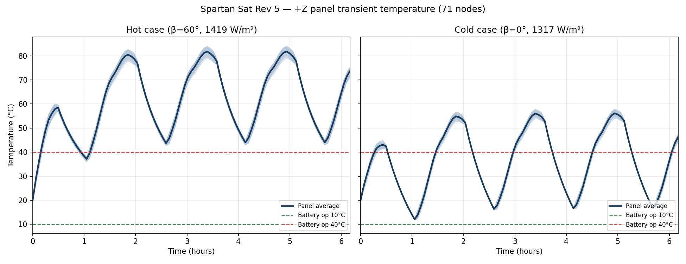
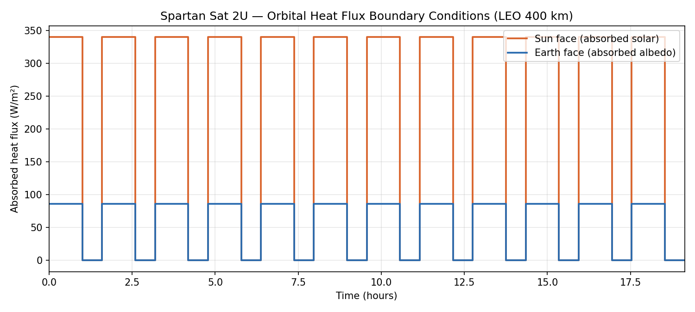
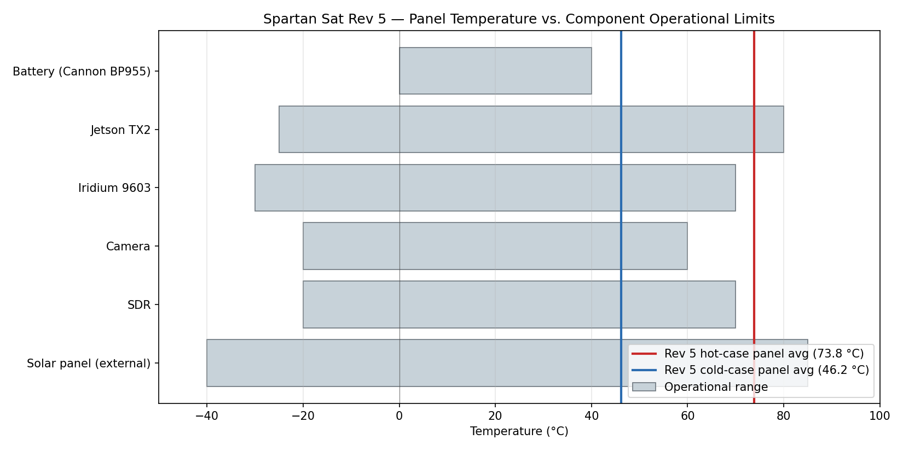
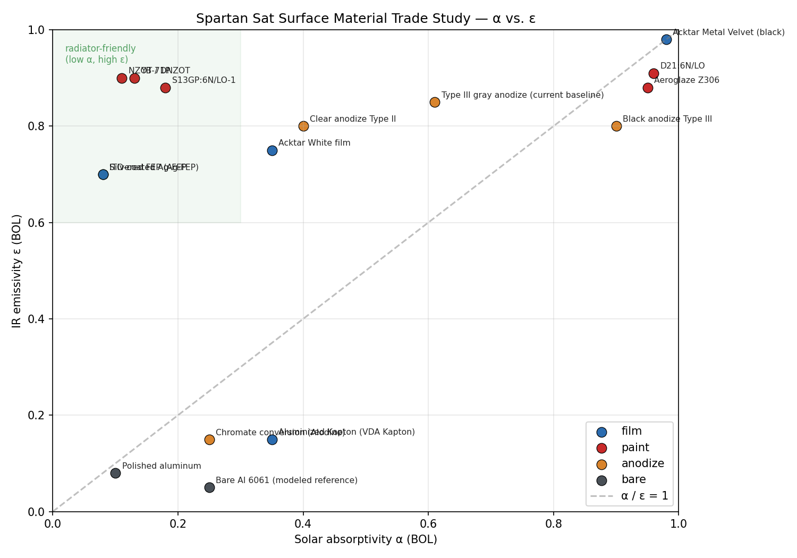

# Spartan Sat — Thermal Engineering

**Thermal analysis and control design for the Spartan Sat 2U CubeSat (LEO → lunar flyby), SJSU CubeSat program.**



## TL;DR

- **Mission:** 2U CubeSat, ISS deployment to low Earth orbit (~400 km), with a follow-on lunar flyby phase.
- **My role:** sole thermal engineer — environment definition, CAD integration, Thermal Desktop / RadCAD model, materials trade study, post-processing, Rev 1 → Rev 5 design iteration.
- **Tools:** C&R Thermal Desktop + RadCAD (primary), ANSYS Workbench Mechanical (verification), SolidWorks (CAD), Python (post-processing).
- **Headline finding:** The Rev 5 bare-anodize 2U design reaches **~74 °C panel average in the hot case** — above the battery's 40 °C operational ceiling. A low-α coating patch (NZOT white paint or silvered FEP film) on the +Z panel is the next design move.

## Contents

| Folder | What's in it |
|--------|--------------|
| [`docs/`](docs/) | Six short technical documents — mission, requirements, methodology, materials, results, design evolution |
| [`figures/`](figures/) | Plots used in this README and the docs |
| [`data/`](data/) | Orbital heat-flux boundary conditions, component thermal budget, materials properties, raw simulation output |
| [`analysis/`](analysis/) | Python scripts that regenerate every figure from the data in `data/` |

## Mission and Environment

Spartan Sat is designed for a LEO orbit at ~400 km (ISS-like). The thermal environment is bounded by:

| Source | Value |
|--------|-------|
| Solar flux | ~1361 W/m² |
| Earth albedo | 0.14–0.19 → ~185–270 W/m² |
| Earth IR | ~218–228 W/m² |

The ~95-minute orbit is split into ~60 min sunlit arc and ~35 min eclipse. Two bounding design cases are carried through the analysis: a **hot case** (β = 60°, solar = 1419 W/m², albedo = 0.55) and a **cold case** (β = 0°, solar = 1317 W/m², albedo = 0.18). See [`docs/01-mission-and-environment.md`](docs/01-mission-and-environment.md).

## Component Thermal Requirements

Key flight components and their operational temperature limits:

| Component | Power | Op range | Driver |
|-----------|------:|----------|--------|
| Battery (Cannon BP955) | 0.17 W | **0 to +40 °C** | Charge/discharge, cell life |
| Jetson TX2 | 15 W | −25 to +80 °C | Silicon junction |
| Iridium 9603 | 0.8 W | −30 to +70 °C | IC derating |
| Solar panels | (generator) | −40 to +85 °C | Cell efficiency |

The **battery drives the hot-side design.** Its 40 °C operational ceiling is the binding constraint. See [`docs/02-thermal-requirements.md`](docs/02-thermal-requirements.md) and [`data/component-thermal-budget.csv`](data/component-thermal-budget.csv).

## Orbital Heat Flux

Step-function absorbed-flux boundary conditions applied to the sun-facing and nadir-facing panels:



Data: [`data/orbital-heat-flux/`](data/orbital-heat-flux/) — sun-face and earth-face CSV / XLSX, 12 orbits, ~68,900 s of simulated time.

## Methodology

- **Geometry:** 2U CubeSat (0.1 × 0.1 × 0.2 m), SolidWorks → Thermal Desktop.
- **Mesh:** ~70 nodes on the +Z face (8×16 per large face).
- **Radiative exchange:** RadCAD Monte Carlo, **5,000 rays per node**.
- **Analysis:** Transient, ~6 orbits per case, 293.15 K initial.
- **Verification:** Independent ANSYS Mechanical runs on simplified cases + Excel radiation-balance hand calc.

See [`docs/03-methodology.md`](docs/03-methodology.md).

## Key Results — Rev 5

| Metric | Hot case | Cold case |
|--------|---------:|----------:|
| Final panel average | **73.8 °C** | **46.2 °C** |
| Battery op margin (40 °C ceiling) | **−34 °C** (fail) | −6 °C (fail) |



The simulation is doing its job: it tells the design team that a passive-only bare-aluminum exterior is insufficient. Active or coating-based thermal control is required. Full discussion in [`docs/05-results.md`](docs/05-results.md).

## Materials Trade Study

16 candidate surface treatments catalogued across films, paints, anodizations, and phase-change materials — with BOL α / ε, supplier, cost, and usage notes.



Top radiator candidates for the +Z sun-view panel: **NZOT white paint** (α ≈ 0.11, ε ≈ 0.90) and **silvered FEP film** (α ≈ 0.08, ε ≈ 0.70). See [`docs/04-materials-and-coatings.md`](docs/04-materials-and-coatings.md) and [`data/materials-properties.csv`](data/materials-properties.csv).

## Design Evolution

Five revisions from September 2025 to March 2026: a 1U first-principles checkout in ANSYS Mechanical → 2U baseline → mesh refinement → migration to Thermal Desktop → internal component integration → finalized load cases. Each iteration was a scoped response to a specific gap in the previous one. See [`docs/06-design-evolution.md`](docs/06-design-evolution.md).

## Thermal Vacuum Test Plan

Model correlation and component verification will be performed in a thermal-vacuum chamber before flight. The test campaign covers the battery, Jetson TX2, Iridium 9603, sensor payload, and an integrated 2U flat-sat — with a target model-vs-measurement correlation band of **±5 °C on ≥ 90% of instrumented nodes**. See [`docs/07-thermal-vacuum-test-plan.md`](docs/07-thermal-vacuum-test-plan.md).

## Skills Demonstrated

- **Spacecraft thermal analysis:** radiative heat transfer, orbital heat-flux modeling, hot/cold case definition, transient steady-cycle solutions.
- **Tools:** Thermal Desktop + RadCAD, ANSYS Workbench Mechanical, SolidWorks, Python (pandas, numpy, matplotlib).
- **Engineering process:** requirements traceability (component limits → design cases), iterative design (5 revisions), trade studies, independent verification.
- **Communication:** written documentation for a technical audience.

## Reproduce the Figures

```bash
git clone https://github.com/<your-username>/spartan-sat-thermal.git
cd spartan-sat-thermal/analysis
pip install -r requirements.txt
python plot_orbital_loads.py
python plot_transient_temperatures.py
python hot_cold_case_summary.py
python plot_materials_tradeoff.py
```

Every figure in this repo is regenerated from the data in `data/`.

## Contact

Martin Nguyen — [LinkedIn](https://www.linkedin.com/in/martinnguyen0/) · marngu06@gmail.com
