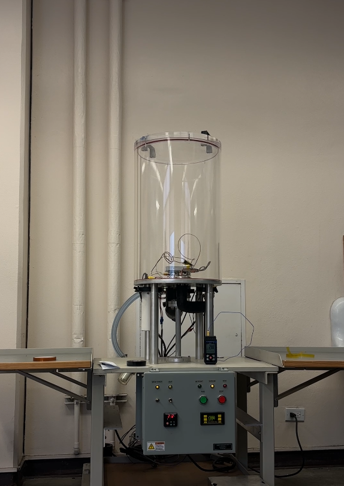
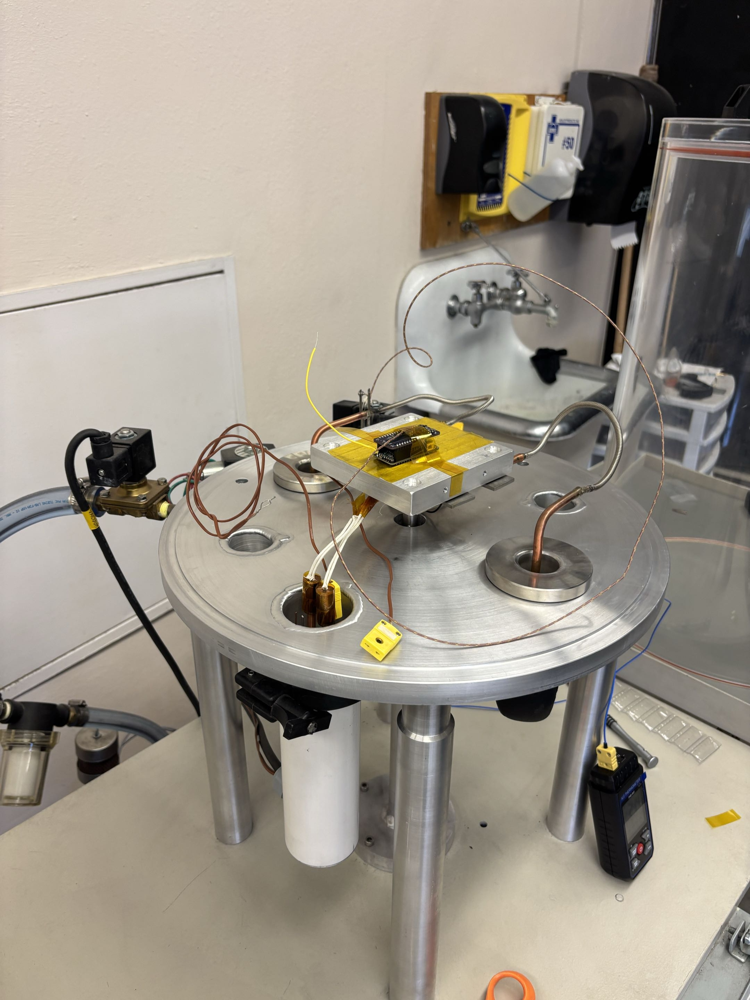

# 07 — Preliminary Thermal Vacuum Testing

Preliminary thermal-vacuum (TVAC) testing was performed to verify that key flight components can survive and operate under vacuum and thermal loading.

## Facility & Instrumentation

Testing was conducted using a benchtop bell-jar vacuum chamber. Chamber pressure was monitored with a VGC301 Convection Vacuum Gauge Controller, which provided real-time pressure readout during pump-down and dwell. The mechanical pump brought the chamber down to rough vacuum (~0.01 Pa).

  

Temperature data was collected using type-T thermocouples (4–6 channels per run) bonded with Kapton tape to the test articles and the chamber baseplate. A handheld DAQ logged thermocouple readings at ~1 Hz throughout each run.

## Test Articles

- **Battery (Cannon BP955)** — the primary concern given its tight operational window (0 to +40 °C). Tested under vacuum to verify it could hold charge, discharge normally, and not exhibit swelling or outgassing at reduced pressure.
- **Temperature sensors (type-T thermocouples)** — verified that the thermocouple-to-surface bond (Kapton tape attachment) held through pump-down and venting cycles, and that readings stayed consistent between ambient and vacuum conditions.
- **Representative PCB assembly** — a small electronics board with similar thermal mass to the flight avionics stack. Used to check for any vacuum-related issues like arcing, and solder joint behavior.

  

Test article on the aluminum baseplate, instrumented with type-T thermocouples and routed out through the chamber feedthrough.

## Methodology

Each test run followed a straightforward three-phase profile:

1. **Ambient baseline.** Power on the test article at atmospheric pressure and room temperature. Log steady-state temperatures with convection present to establish a baseline.
2. **Pump-down and vacuum dwell.** Bring the chamber down to a vacuum & monitor data on the VGC301. Hold at vacuum for 5 minutes while the test article remained powered.
3. **Vent and inspection.** Return the chamber to atmospheric pressure, power down, and inspect the test articles for any physical damage, outgassing residue, or performance degradation.

## Results

All three test articles came through the preliminary runs without issue:

- The battery held charge and discharged normally after vacuum exposure. No swelling, leaking, or measurable capacity loss was observed.
- Thermocouple bonds survived pump-down and venting cleanly. The Kapton tape attachment method was validated for future tests
- The PCB operated nominally under vacuum. No arcing or solder joint issues.

## Limitations

- Rough vacuum only
- No solar or IR simulation lamp
- Limited thermocouple channels
- Component-level testing only

## References

1. NASA GSFC, _General Environmental Verification Standard (GEVS)_, GSFC-STD-7000 — background on flight TVAC practice.
2. NASA Ames, _Small Spacecraft Thermal Modeling Guide_ — see [`docs/03-methodology.md`](03-methodology.md).
